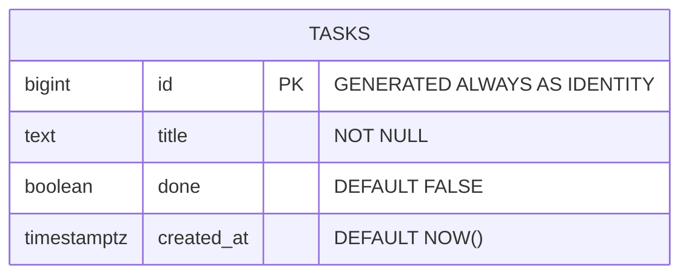
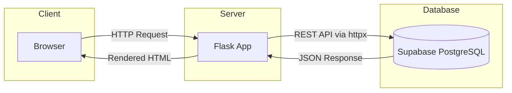
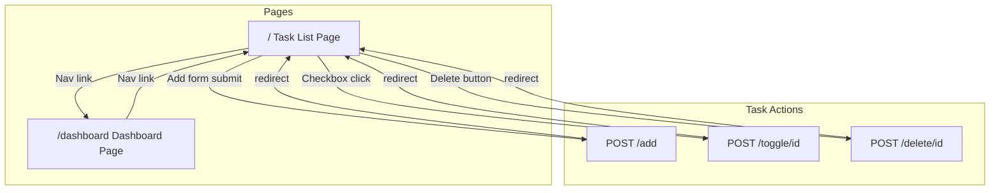
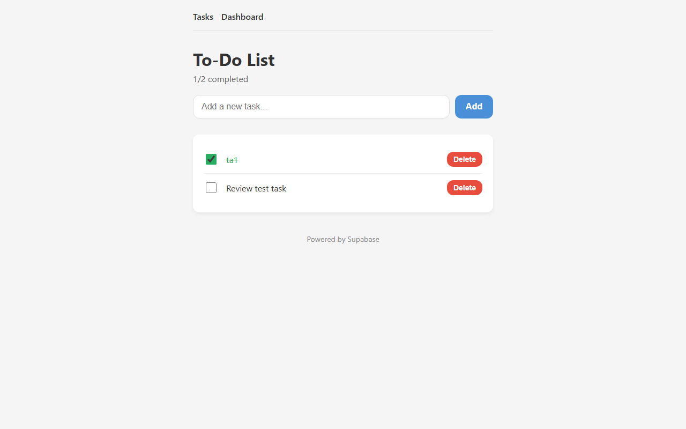
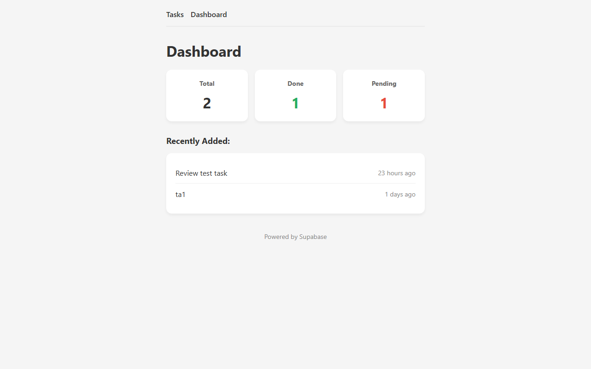
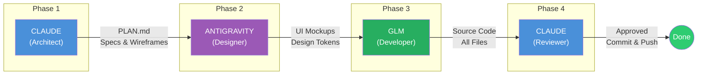

# Web App Development Guide
### Enterprise-Style Lifecycle — Applied to the To-Do Project

> This guide follows the same structured process that large software companies use  
> to build web applications, adapted for solo/small-team AI-assisted development.

---

## Table of Contents

1. [Phase 1: Requirements & Planning](#phase-1-requirements--planning)
2. [Phase 2: Database Design](#phase-2-database-design)
3. [Phase 3: Page Layouts & Wireframes](#phase-3-page-layouts--wireframes)
4. [Phase 4: UI/UX Design](#phase-4-uiux-design)
5. [Phase 5: Implementation](#phase-5-implementation)
6. [Phase 6: Review & QA](#phase-6-review--qa)
7. [Phase 7: Deployment & Maintenance](#phase-7-deployment--maintenance)
8. [Team Roles (Multi-Model Workflow)](#team-roles-multi-model-workflow)
9. [Checklist Template](#checklist-template)

---

## Phase 1: Requirements & Planning

**Goal:** Define *what* the app does before writing any code.

### Steps

| # | Task | Output |
|---|------|--------|
| 1 | Define the problem the app solves | Problem statement |
| 2 | List target users | User persona(s) |
| 3 | List all features (MVP scope) | Feature list |
| 4 | Define routes / API endpoints | Route table |
| 5 | Choose tech stack | Tech decision doc |

### Applied: To-Do Project

**Problem Statement:**  
A simple task manager to add, complete, and delete to-do items with a dashboard for quick stats.

**Target Users:**  
Single user (personal task tracking).

**Feature List (MVP):**
- Add a task
- Mark task as done / not done
- Delete a task
- View all tasks
- Dashboard with stats (total, done, pending, recent)

**Route Table:**

| Method | Route | Action |
|--------|-------|--------|
| GET | `/` | Show task list |
| GET | `/dashboard` | Show stats |
| POST | `/add` | Create new task |
| POST | `/toggle/<id>` | Toggle done status |
| POST | `/delete/<id>` | Delete task |

**Tech Stack Decision:**

| Layer | Choice | Why |
|-------|--------|-----|
| Backend | Python Flask | Lightweight, easy to learn |
| Database | Supabase PostgreSQL | Free tier, REST API, no ORM needed |
| HTTP Client | httpx | Modern Python HTTP library |
| Frontend | Jinja2 + CSS | Server-rendered, no JS framework needed |
| Config | python-dotenv | Keep secrets out of code |

---

## Phase 2: Database Design

**Goal:** Design the data model before building anything.

### Steps

| # | Task | Output |
|---|------|--------|
| 1 | Identify entities (nouns in your features) | Entity list |
| 2 | Define columns for each entity | Column specs |
| 3 | Define relationships (if multiple tables) | ER diagram |
| 4 | Choose primary keys, defaults, constraints | Schema SQL |
| 5 | Create tables in Supabase | Live database |

### Applied: To-Do Project

**Entities:** Only one — `tasks`

**Schema:**

```sql
CREATE TABLE tasks (
    id          BIGINT GENERATED ALWAYS AS IDENTITY PRIMARY KEY,
    title       TEXT NOT NULL,
    done        BOOLEAN DEFAULT FALSE,
    created_at  TIMESTAMPTZ DEFAULT NOW()
);
```

**Column Decisions:**

| Column | Type | Why |
|--------|------|-----|
| `id` | BIGINT IDENTITY | Auto-incrementing, unique identifier |
| `title` | TEXT NOT NULL | Task name — required, no empty tasks |
| `done` | BOOLEAN DEFAULT FALSE | New tasks start incomplete |
| `created_at` | TIMESTAMPTZ DEFAULT NOW() | Track when task was added |

**Entity-Relationship Diagram:**



**Data Flow Diagram:**



**For larger apps, this phase would also include:**
- Multiple related tables with foreign keys
- Indexes for performance
- Row Level Security (RLS) policies
- Migration scripts

---

## Phase 3: Page Layouts & Wireframes

**Goal:** Sketch every screen before designing or coding it.

### Steps

| # | Task | Output |
|---|------|--------|
| 1 | List all pages/screens | Page inventory |
| 2 | Draw wireframe for each page | ASCII or visual wireframes |
| 3 | Define content blocks and user actions | Interaction map |
| 4 | Define navigation flow | Navigation diagram |

### Applied: To-Do Project

**Page Inventory:** 2 pages — Task List, Dashboard

**Wireframe: Task List (`/`)**

```
+------------------------------------------+
|  [Tasks]  [Dashboard]          <- nav    |
+------------------------------------------+
|                                          |
|  To-Do List                              |
|  3/5 completed                           |
|                                          |
|  [_________________________] [+ Add]     |
|                                          |
|  [ ] Buy groceries                   [x] |
|  [v] Learn Flask                     [x] |
|  [ ] Setup Supabase                  [x] |
|  [v] Write guide                     [x] |
|  [ ] Deploy app                      [x] |
|                                          |
|         Powered by Supabase              |
+------------------------------------------+
```

**Wireframe: Dashboard (`/dashboard`)**

```
+------------------------------------------+
|  [Tasks]  [Dashboard]          <- nav    |
+------------------------------------------+
|                                          |
|  Dashboard                               |
|                                          |
|  +----------+  +----------+  +--------+  |
|  | Total    |  | Done     |  | Pending|  |
|  |    5     |  |    3     |  |    2   |  |
|  +----------+  +----------+  +--------+  |
|                                          |
|  Recently Added:                         |
|  - Deploy app         (2 min ago)        |
|  - Write guide        (1 hour ago)       |
|  - Setup Supabase     (3 hours ago)      |
|                                          |
+------------------------------------------+
```

**Navigation Flow:**



**Screenshots:**

> Add screenshots of the running app here.  
> Run `python app.py`, open `http://localhost:5000`, and capture:
>
> | Page | Screenshot |
> |------|-----------|
> | Task List |  |
> | Dashboard |  |
>
> Save images to `docs/images/` folder.

---

## Phase 4: UI/UX Design

**Goal:** Define the visual identity and create polished mockups.

### Steps

| # | Task | Output |
|---|------|--------|
| 1 | Define design tokens (colors, fonts, spacing) | Design token sheet |
| 2 | Create high-fidelity mockups | Mockup images |
| 3 | Define component styles (buttons, cards, forms) | Component specs |
| 4 | Define responsive behavior | Breakpoint rules |

### Applied: To-Do Project

**Design Tokens:**

| Token | Value | Usage |
|-------|-------|-------|
| Font | `-apple-system, sans-serif` | All text |
| Primary | `#4a90d9` | Nav, buttons, links |
| Danger | `#e74c3c` | Delete buttons |
| Success | `#27ae60` | Completed tasks |
| Background | `#f5f5f5` | Page background |
| Card BG | `#ffffff` | Content cards |
| Border Radius | `12px` | Cards, buttons |
| Max Width | `600px` | Content container |
| Spacing | `1rem / 1.5rem` | Padding, margins |

**Component Specs:**

| Component | Style |
|-----------|-------|
| Nav bar | Primary color background, white text, links |
| Task item | White card, flex row, checkbox + title + delete |
| Stat card | White card, centered number, label below |
| Add form | Text input + primary button, inline |
| Delete button | Small, danger color, "x" icon |
| Done task | Title gets strikethrough + muted color |

**Responsive Rules:**
- Mobile-first: single column
- Max-width 600px centered container
- Stat cards stack on small screens

---

## Phase 5: Implementation

**Goal:** Write the code based on everything defined above.

### Steps

| # | Task | Output |
|---|------|--------|
| 1 | Set up project structure (folders, files) | Scaffold |
| 2 | Configure environment (.env, requirements) | Config files |
| 3 | Build backend (routes, database calls) | `app.py` |
| 4 | Build templates (HTML pages) | `templates/` |
| 5 | Build styles (CSS) | `static/style.css` |
| 6 | Test locally | Working app on localhost |

### Applied: To-Do Project

**Project Structure:**

```
ToDoTasks Rebuild Project/
  app.py                 <- Flask app (~80 lines)
  templates/
    base.html            <- Shared layout
    index.html           <- Task list page
    dashboard.html       <- Dashboard page
  static/
    style.css            <- All styles (~80 lines)
  .env                   <- SUPABASE_URL, SUPABASE_KEY
  .gitignore             <- .env, __pycache__/, *.pyc
  requirements.txt       <- flask, httpx, python-dotenv
```

**Implementation Order:**
1. `requirements.txt` and `.env` first (dependencies)
2. `app.py` — routes and Supabase calls
3. `templates/base.html` — shared layout
4. `templates/index.html` — task list
5. `templates/dashboard.html` — stats page
6. `static/style.css` — styling last

**Key Code Pattern — Supabase REST:**

```python
# All database calls follow this pattern:
REST_URL = f"{SUPABASE_URL}/rest/v1"
HEADERS = {
    "apikey": SUPABASE_KEY,
    "Authorization": f"Bearer {SUPABASE_KEY}",
    "Content-Type": "application/json",
    "Prefer": "return=representation"
}

# GET tasks
response = httpx.get(f"{REST_URL}/tasks?order=id.asc", headers=HEADERS)

# POST new task
httpx.post(f"{REST_URL}/tasks", headers=HEADERS, json={"title": title})

# PATCH (update) task
httpx.patch(f"{REST_URL}/tasks?id=eq.{id}", headers=HEADERS, json={"done": new_value})

# DELETE task
httpx.delete(f"{REST_URL}/tasks?id=eq.{id}", headers=HEADERS)
```

---

## Phase 6: Review & QA

**Goal:** Verify the app works correctly before shipping.

### Steps

| # | Task | Output |
|---|------|--------|
| 1 | Manual testing — all user flows | Test results |
| 2 | Code review — quality, security, style | Review notes |
| 3 | Fix any issues found | Bug fixes |
| 4 | Git commit with clear message | Clean commit |

### Applied: To-Do Project

**Test Checklist:**

- [ ] App starts without errors (`python app.py`)
- [ ] Task list page loads at `localhost:5000`
- [ ] Can add a new task
- [ ] New task appears in the list
- [ ] Can toggle task done/undone
- [ ] Done tasks show strikethrough
- [ ] Can delete a task
- [ ] Dashboard shows correct counts
- [ ] Dashboard shows recent tasks
- [ ] Data matches Supabase Table Editor
- [ ] Nav links work between pages

**Code Review Checklist:**

- [ ] No secrets in committed code (.env is gitignored)
- [ ] No SQL injection (using Supabase REST, not raw SQL)
- [ ] Error handling for API failures
- [ ] Clean code — no unused imports or dead code
- [ ] Consistent naming and formatting

---

## Phase 7: Deployment & Maintenance

**Goal:** Make the app available online and keep it running.

### Steps

| # | Task | Output |
|---|------|--------|
| 1 | Choose hosting platform | Deployment target |
| 2 | Configure for production | Production config |
| 3 | Deploy | Live URL |
| 4 | Monitor and maintain | Ongoing |

### Future (Not Yet Applied)

| Platform | Free Tier | Notes |
|----------|-----------|-------|
| Render | Yes | Easy Flask deployment |
| Railway | Yes | Simple, GitHub integration |
| Vercel | Limited | Better for frontend-only |

---

## Team Roles (Multi-Model Workflow)

In a large company, different teams handle different phases.  
In this workflow, different AI models fill those roles:



| Role | Real Company Equivalent | AI Model |
|------|------------------------|----------|
| Architect / PM | Product Manager + Tech Lead | Claude |
| Designer | UI/UX Design Team | Antigravity |
| Developer | Engineering Team | GLM |
| Reviewer | QA + Senior Engineer | Claude |

---

## Checklist Template

Copy this for every new project:

```markdown
## Project: [Name]

### Phase 1: Requirements & Planning
- [ ] Problem statement written
- [ ] Features listed (MVP scope)
- [ ] Routes / API defined
- [ ] Tech stack chosen

### Phase 2: Database Design
- [ ] Entities identified
- [ ] Schema SQL written
- [ ] Tables created in Supabase

### Phase 3: Page Layouts
- [ ] All pages listed
- [ ] Wireframes drawn for each page
- [ ] Navigation flow defined

### Phase 4: UI/UX Design
- [ ] Design tokens defined
- [ ] Mockups created (Antigravity)
- [ ] Component styles specified

### Phase 5: Implementation
- [ ] Project scaffold created
- [ ] Backend coded (GLM)
- [ ] Templates coded
- [ ] Styles coded
- [ ] Runs locally

### Phase 6: Review & QA
- [ ] All features manually tested
- [ ] Code reviewed
- [ ] Bugs fixed
- [ ] Git committed

### Phase 7: Deployment
- [ ] Hosting chosen
- [ ] Deployed to production
- [ ] Verified live
```

---

*This guide was created as part of learning enterprise-style web development.*  
*Applied to: ToDoTasks Rebuild Project | April 2026*
